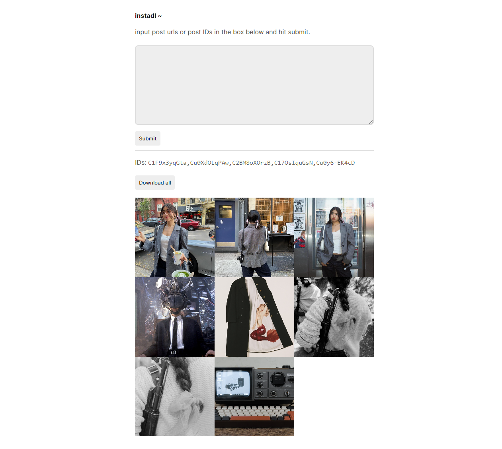

instadl
=======

Bulk download instagram posts.

Install
-------

	go install go.zakaria.org/instadl@latest

Dependencies
------------

Depends on [instaloader](https://github.com/instaloader/instaloader) Python
script for downloading posts.

Running
-------

	usage: instadl [-d directory] [-s path] [-l listen_addr]
	where:
		-d	local path to /static directory (defaults to ./static). this is where
		 	posts are saved.
		-s	local path to style.css (defaults to /style.css in path specified by -d).
		-l	listen address (defaults to "0.0.0.0:8585").

